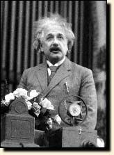

# Introduction

This is the demo page of our paper submitted to ICLR 2026.

### 1. Examples of our speech enhancement model applied to speech from movies and YouTube:

**Example 1: [Jensen's speech](https://www.youtube.com/watch?v=zbzCiau3hWc&t=24s)**

**Original noisy (noisy, highly-reverb, bandwidth-limitation (16kHz))**:

<audio style="width:320px" controls="controls">
	<source src="wavs/Run_noisy.wav" type="audio/wav" />
</audio>

**Enhanced:** 

<audio style="width:320px" controls="controls">
	<source src="wavs/Run.wav" type="audio/wav" />
</audio>

**Enhanced and bandwidth extension to 32k:**  

<audio style="width:320px" controls="controls">
	<source src="wavs/Run_32k_kaiser_best.flac" type="audio/wav" />
</audio>

-----------------------------------------------------------

**Example 2: [Einstein's speech](https://history.aip.org/exhibits/einstein/voice3.htm)**

*** transcript: Large parts of the world are faced with starvation, while others are living in abundance.  	

**Original noisy (noisy, clipping, mp3 artifact, bandwidth-limitation (8kHz))**:

<audio style="width:320px" controls="controls">
	<source src="wavs/Einstein_mp3_8k_noisy.wav" type="audio/wav" />
</audio>

**Enhanced:** 

<audio style="width:320px" controls="controls">
	<source src="wavs/Einstein_mp3_8k.wav" type="audio/wav" />
</audio>

**Enhanced and bandwidth extension to 16k:**  

<audio style="width:320px" controls="controls">
	<source src="wavs/Einstein_mp3_8k_16k.wav" type="audio/wav" />
</audio>
