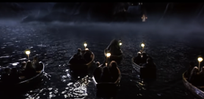

# Introduction

This is the demo page of our paper submitted to ICLR 2026.

### Examples of Non-blind test set of the URGENT 2025 Challenge:
Note: 
1. We provide examples for multiple languages.

2. The difference between Early Reflected and Shifted Anechoic speech training targets is noticeable only when the input noisy speech contains reverberation.

3. The effect of the GAN correction is typically audible only under **severe** degradations (e.g., low SNR, packet loss, bandwidth extension, etc.).

### Example1:

**Noisy (noise, codec, reverb):**

<audio style="width:320px" controls="controls">
	<source src="wavs/noisy_18.flac" type="audio/wav" />
</audio>

**Early-reflected:**

<audio style="width:320px" controls="controls">
	<source src="wavs/early_18.flac" type="audio/wav" />
</audio>

**Early-reflected + GAN:**

<audio style="width:320px" controls="controls">
	<source src="wavs/early+GAN_18.flac" type="audio/wav" />
</audio>

**Shifted anechoic clean:**

<audio style="width:320px" controls="controls">
	<source src="wavs/shifted_18.flac" type="audio/wav" />
</audio>

**Shifted anechoic clean + GAN:**

<audio style="width:320px" controls="controls">
	<source src="wavs/shifted+GAN_18.flac" type="audio/wav" />
</audio>

-----------------------------------------------------------
### Example2:

**Noisy  (noise, codec, reverb):**

<audio style="width:320px" controls="controls">
	<source src="wavs/noisy_320.flac" type="audio/wav" />
</audio>

**Early-reflected:**

<audio style="width:320px" controls="controls">
	<source src="wavs/early_320.flac" type="audio/wav" />
</audio>

**Early-reflected + GAN:**

<audio style="width:320px" controls="controls">
	<source src="wavs/early+GAN_320.flac" type="audio/wav" />
</audio>

**Shifted anechoic clean:**

<audio style="width:320px" controls="controls">
	<source src="wavs/shifted_320.flac" type="audio/wav" />
</audio>

**Shifted anechoic clean + GAN:**

<audio style="width:320px" controls="controls">
	<source src="wavs/shifted+GAN_320.flac" type="audio/wav" />
</audio>

-----------------------------------------------------------
### Example3:

**Noisy (noise, packet loss, reverb):**

<audio style="width:320px" controls="controls">
	<source src="wavs/noisy_344.flac" type="audio/wav" />
</audio>

**Early-reflected:**

<audio style="width:320px" controls="controls">
	<source src="wavs/early_344.flac" type="audio/wav" />
</audio>

**Early-reflected + GAN:**

<audio style="width:320px" controls="controls">
	<source src="wavs/early+GAN_344.flac" type="audio/wav" />
</audio>

**Shifted anechoic clean:**

<audio style="width:320px" controls="controls">
	<source src="wavs/shifted_344.flac" type="audio/wav" />
</audio>

**Shifted anechoic clean + GAN:**

<audio style="width:320px" controls="controls">
	<source src="wavs/shifted+GAN_344.flac" type="audio/wav" />
</audio>

-----------------------------------------------------------
### Example4:

**Noisy (noise, packet loss, clipping):**

<audio style="width:320px" controls="controls">
	<source src="wavs/noisy_824.flac" type="audio/wav" />
</audio>

**Early-reflected:**

<audio style="width:320px" controls="controls">
	<source src="wavs/early_824.flac" type="audio/wav" />
</audio>

**Early-reflected + GAN:**

<audio style="width:320px" controls="controls">
	<source src="wavs/early+GAN_824.flac" type="audio/wav" />
</audio>

**Shifted anechoic clean:**

<audio style="width:320px" controls="controls">
	<source src="wavs/shifted_824.flac" type="audio/wav" />
</audio>

**Shifted anechoic clean + GAN:**

<audio style="width:320px" controls="controls">
	<source src="wavs/shifted+GAN_824.flac" type="audio/wav" />
</audio>

-----------------------------------------------------------

### Examples of our speech enhancement model applied to real noisy speech:

**Example 1: [Jensen's speech](https://www.youtube.com/watch?v=zbzCiau3hWc&t=24s)**

**Original input (noisy, highly-reverb, bandwidth-limitation (16kHz))**:

<audio style="width:320px" controls="controls">
	<source src="wavs/Run_noisy.wav" type="audio/wav" />
</audio>

**Enhanced:** 

<audio style="width:320px" controls="controls">
	<source src="wavs/Run.wav" type="audio/wav" />
</audio>

**Enhanced and bandwidth extension to 32k:**  

<audio style="width:320px" controls="controls">
	<source src="wavs/Run_32k_kaiser_best.flac" type="audio/wav" />
</audio>

-----------------------------------------------------------

**Example 2: [Einstein's speech](https://history.aip.org/exhibits/einstein/voice3.htm)**

**transcript: Large parts of the world are faced with starvation, while others are living in abundance.**  	

**Original input (noisy, clipping, mp3 artifact, bandwidth-limitation (8kHz))**:

<audio style="width:320px" controls="controls">
	<source src="wavs/Einstein_mp3_8k_noisy.wav" type="audio/wav" />
</audio>

**Enhanced:** 

<audio style="width:320px" controls="controls">
	<source src="wavs/Einstein_mp3_8k.wav" type="audio/wav" />
</audio>

**Enhanced and bandwidth extension to 16k:**  

<audio style="width:320px" controls="controls">
	<source src="wavs/Einstein_mp3_8k_16k.wav" type="audio/wav" />
</audio>

-----------------------------------------------------------

**Example 3: [Apollo 11 astronaut Neil Armstrong gives his classic confirmation of the first footsteps on the moon](https://science.nasa.gov/resource/sounds-of-mars-one-small-step/)**

**transcript: One small step for (a) man, one giant leap for mankind.**  	

**Original input (noisy, bandwidth-limitation)**:

<audio style="width:320px" controls="controls">
	<source src="wavs/sounds-of-mars-one-small-step-earth_noisy.wav" type="audio/wav" />
</audio>

**Enhanced and bandwidth extension to 16k:**  

<audio style="width:320px" controls="controls">
	<source src="wavs/sounds-of-mars-one-small-step-earth_8kto16k.wav" type="audio/wav" />
</audio>

-----------------------------------------------------------

**Example 4: [Harry Potter and the Philosopher's Stone](https://youtu.be/ibRcSCRAyTA?t=22) (2001)**

**Original input (noisy (music), bandwidth-limitation (16kHz))**:

<audio style="width:320px" controls="controls">
	<source src="wavs/Potter_noisy.wav" type="audio/wav" />
</audio>

**Enhanced:** 

<audio style="width:320px" controls="controls">
	<source src="wavs/Potter.wav" type="audio/wav" />
</audio>

**Enhanced and bandwidth extension to 32k:**  

<audio style="width:320px" controls="controls">
	<source src="wavs/Potter_32k.wav" type="audio/wav" />
</audio>

-----------------------------------------------------------

**Example 5: [Airport announcements](https://www.youtube.com/watch?v=7y9asDUhwTc)**

**Original input (noisy, highly-reverb, multi-lingual, TTS speech)**:

<audio style="width:320px" controls="controls">
	<source src="wavs/airport_noisy.wav" type="audio/wav" />
</audio>

**Enhanced:** 

<audio style="width:320px" controls="controls">
	<source src="wavs/airport.wav" type="audio/wav" />
</audio>

### The overall ranking table for the non-blind test set of the URGENT 2025 Challenge (considering only the Early Reflected learning target for consistency):

| Team          | DNSMOS    | NISQA      | UTMOS     | PESQ      | ESTOI     | SDR        | MCD        | LSD        | SpeechBERTScore | LPS       | SpkSim    | CAcc (%)   | Overall ranking score |
|---------------|-----------|------------|-----------|-----------|-----------|------------|------------|------------|------------------|-----------|-----------|------------|------------------------|
| Bobbsun       | 3.01 (8)  | 3.41 (6)   | 2.4 (3)   | 2.95 (1)  | 0.86 (1)  | 14.33 (1)  | 3.01 (4)   | 2.83 (5)   | 0.91 (1)         | 0.86 (1)  | 0.85 (1)  | 88.92 (1)  | 2.516           |
| **Our Early reflected + GAN correction**| 3.04 (5)  | 3.53 (3)   | 2.3 (6)   | 2.78 (4)  | 0.84 (4)  | 12.25 (5)  | 2.97 (3)   | 2.75 (4)   | 0.9 (2)          | 0.84 (3)  | 0.85 (1)  | 88.13 (2)  | 3.166           |
| rc            | 3.01 (8)  | 3.21 (9)   | 2.3 (6)   | 2.79 (3)  | 0.85 (2)  | 13.11 (2)  | 2.93 (2)   | 2.94 (8)   | 0.9 (2)          | 0.85 (2)  | 0.84 (3)  | 88.05 (3)  | 4.016           |
| **Our Early reflected**| 3.06 (4) | 3.23 (8)   | 2.26 (8)  | 2.81 (2)  | 0.85 (2)  | 12.28 (4)  | 2.87 (1)   | 2.66 (1)   | 0.9 (2)          | 0.84 (3)  | 0.82 (5)  | 87.62 (5)  | 4.041           |
| Xiaobin       | 3.0 (10)  | 3.45 (4)   | 2.31 (5)  | 2.74 (5)  | 0.84 (4)  | 13.06 (3)  | 3.3 (6)    | 3.08 (11)  | 0.89 (5)         | 0.84 (3)  | 0.83 (4)  | 87.94 (4)  | 5.033           |
| subatomicseer | 3.02 (6)  | 3.28 (7)   | 2.34 (4)  | 2.63 (7)  | 0.82 (6)  | 12.18 (6)  | 3.9 (12)   | 3.06 (10)  | 0.88 (7)         | 0.82 (6)  | 0.82 (5)  | 86.15 (7)  | 6.591           |
| poisonous     | 3.02 (6)  | 3.42 (5)   | 2.26 (8)  | 2.72 (6)  | 0.82 (6)  | 11.93 (8)  | 3.36 (9)   | 2.69 (2)   | 0.89 (5)         | 0.81 (8)  | 0.8 (8)   | 85.65 (8)  | 6.758           |
| byti.shsy     | 2.96 (12) | 3.15 (10)  | 2.18 (10) | 2.44 (9)  | 0.82 (6)  | 12.09 (7)  | 3.28 (5)   | 3.27 (12)  | 0.88 (7)         | 0.82 (6)  | 0.82 (5)  | 86.46 (6)  | 7.616           |
| Lam-Fung      | 2.97 (11) | 2.95 (12)  | 2.11 (15) | 2.43 (10) | 0.8 (9)   | 11.37 (9)  | 3.32 (7)   | 2.84 (6)   | 0.86 (10)        | 0.79 (9)  | 0.8 (8)   | 84.93 (10) | 9.8416           |
| urgent        | 2.94 (13) | 2.89 (13)  | 2.11 (15) | 2.43 (10) | 0.8 (9)   | 11.29 (10) | 3.32 (7)   | 2.85 (7)   | 0.86 (10)        | 0.79 (9)  | 0.8 (8)   | 84.96 (9)  | 10.066           |
| cobalamin     | 3.11 (3)  | 2.7 (17)   | 2.15 (11) | 2.22 (14) | 0.71 (16) | 6.22 (16)  | 3.44 (10)  | 2.72 (3)   | 0.87 (9)         | 0.79 (9)  | 0.78 (12) | 83.73 (11) | 10.658           |
| alindborg     | 3.28 (1)  | 3.96 (2)   | 2.49 (2)  | 1.99 (15) | 0.76 (13) | 7.49 (15)  | 4.51 (15)  | 3.73 (14)  | 0.84 (14)        | 0.77 (14) | 0.77 (13) | 81.7 (14)  | 10.891           |
| SQuad         | 2.91 (16) | 2.89 (13)  | 2.06 (17) | 2.35 (12) | 0.8 (9)   | 10.93 (11) | 3.57 (11)  | 3.03 (9)   | 0.86 (10)        | 0.79 (9)  | 0.79 (11) | 83.71 (12) | 11.683           |
| dy            | 2.93 (15) | 2.97 (11)  | 2.14 (13) | 2.56 (8)  | 0.78 (12) | 9.58 (12)  | 4.4 (13)   | 3.28 (13)  | 0.85 (13)        | 0.78 (13) | 0.77 (13) | 83.2 (13)  | 12.65                  |
| wataru9871    | 3.18 (2)  | 4.01 (1)   | 2.78 (1)  | 1.36 (19) | 0.56 (19) | -13.88 (19)| 11.25 (19) | 7.98 (19)  | 0.82 (17)        | 0.73 (17) | 0.51 (19) | 79.7 (18)  | 13.958           |
| IASP_Q        | 2.94 (13) | 2.77 (16)  | 2.14 (13) | 2.25 (13) | 0.76 (13) | 6.0 (17)   | 5.21 (16)  | 4.31 (15)  | 0.83 (15)        | 0.74 (15) | 0.69 (16) | 80.03 (17) | 15.075                |
| hanhw96       | 2.63 (18) | 2.42 (18)  | 1.87 (18) | 1.91 (17) | 0.72 (15) | 8.28 (13)  | 4.41 (14)  | 4.89 (16)  | 0.83 (15)        | 0.74 (15) | 0.7 (15)  | 81.66 (15) | 15.75                 |
| SEES          | 2.88 (17) | 2.8 (15)   | 2.15 (11) | 1.99 (15) | 0.68 (17) | 8.07 (14)  | 5.78 (17)  | 6.59 (18)  | 0.79 (18)        | 0.66 (18) | 0.54 (18) | 71.74 (19) | 16.758          |
| noisy         | 1.84 (19) | 1.69 (19)  | 1.56 (19) | 1.37 (18) | 0.61 (18) | 2.53 (18)  | 7.92 (18)  | 5.51 (17)  | 0.75 (19)        | 0.62 (19) | 0.63 (17) | 81.29 (16) | 18.075                |
