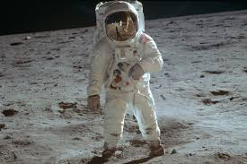

# Introduction

This is the demo page of our paper submitted to ICLR 2026.

### Examples of our speech enhancement model applied to real noisy speech:

**Example 1: [Jensen's speech](https://www.youtube.com/watch?v=zbzCiau3hWc&t=24s)**

**Original input (noisy, highly-reverb, bandwidth-limitation (16kHz))**:

<audio style="width:320px" controls="controls">
	<source src="wavs/Run_noisy.wav" type="audio/wav" />
</audio>

**Enhanced:** 

<audio style="width:320px" controls="controls">
	<source src="wavs/Run.wav" type="audio/wav" />
</audio>

**Enhanced and bandwidth extension to 32k:**  

<audio style="width:320px" controls="controls">
	<source src="wavs/Run_32k_kaiser_best.flac" type="audio/wav" />
</audio>

-----------------------------------------------------------

**Example 2: [Einstein's speech](https://history.aip.org/exhibits/einstein/voice3.htm)**

**transcript: Large parts of the world are faced with starvation, while others are living in abundance.**  	

**Original input (noisy, clipping, mp3 artifact, bandwidth-limitation (8kHz))**:

<audio style="width:320px" controls="controls">
	<source src="wavs/Einstein_mp3_8k_noisy.wav" type="audio/wav" />
</audio>

**Enhanced:** 

<audio style="width:320px" controls="controls">
	<source src="wavs/Einstein_mp3_8k.wav" type="audio/wav" />
</audio>

**Enhanced and bandwidth extension to 16k:**  

<audio style="width:320px" controls="controls">
	<source src="wavs/Einstein_mp3_8k_16k.wav" type="audio/wav" />
</audio>

-----------------------------------------------------------

**Example 3: [Apollo 11 astronaut Neil Armstrong gives his classic confirmation of the first footsteps on the moon](https://science.nasa.gov/resource/sounds-of-mars-one-small-step/)**

**transcript: One small step for (a) man, one giant leap for mankind.**  	

**Original input (noisy, bandwidth-limitation)**:

<audio style="width:320px" controls="controls">
	<source src="wavs/sounds-of-mars-one-small-step-earth_noisy.wav" type="audio/wav" />
</audio>

**Enhanced and bandwidth extension to 32k:**  

<audio style="width:320px" controls="controls">
	<source src="wavs/sounds-of-mars-one-small-step-earth_4kto32k.wav" type="audio/wav" />
</audio>

-----------------------------------------------------------

**Example 4: [Harry Potter and the Philosopher's Stone](https://youtu.be/ibRcSCRAyTA?t=22) (2001)**

**Original input (noisy (music), bandwidth-limitation (16kHz))**:

<audio style="width:320px" controls="controls">
	<source src="wavs/Potter_noisy.wav" type="audio/wav" />
</audio>

**Enhanced:** 

<audio style="width:320px" controls="controls">
	<source src="wavs/Potter.wav" type="audio/wav" />
</audio>

**Enhanced and bandwidth extension to 32k:**  

<audio style="width:320px" controls="controls">
	<source src="wavs/Potter_32k.wav" type="audio/wav" />
</audio>
